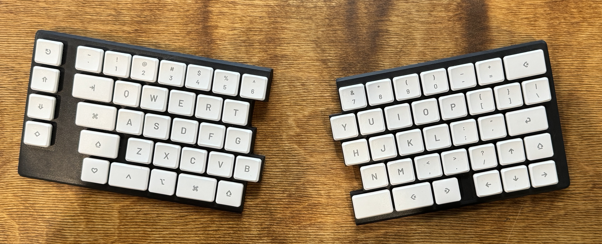
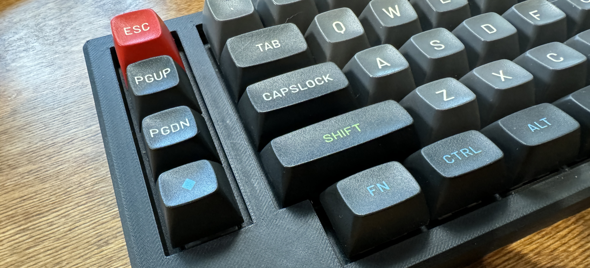

# CB70: A Split, Staggered Wireless Keyboard

- Supports MX and Choc switches
- Dual-wireless, powered by Nice!Nano v2's and ZMK
- Compatible with lots of popular keysets

Why CB70? It's my initials, and it used to be a 70-key layout. When I deleted a key, changing the name to The Joke Number just seemed too obvious.

## What's Available

- KiCAD files for the combo MX/Choc PCBs in `/PCB`
- [Keyboard Layout Editor](http://www.keyboard-layout-editor.com/) JSON for the MX and Choc versions in `/KLE`
- Config files for the ZMK firmware in `/ZMK`, and pre-compiled firmware in `/Firmware`
- OnShape docs for three different cases: [MX](https://cad.onshape.com/documents/61077a70c0807a2f741d218a/w/b756240a5bc81a242d3100ae/e/06f8d761157dde9586b0a508), [Choc](https://cad.onshape.com/documents/518ea40d790487622d23318b/w/b5c85f466e1f1d2c95445d69/e/3acfa7d78165eaa4fb25c29e), and [Choc Slim](https://cad.onshape.com/documents/839a1d1e7ccef3f6cb852ad6/w/885d6dd90bac1c92721256f6/e/4149e8558c641b31c0ba8e37)
- STL files for the 3 different case styles in `/Case`

## The Philosophy

The key layout is based around something I've been honing for almost five years now. I've tried a few different ortho/ergo layouts, but contrary to what the internet says, they always slow me down way too much. Meanwhile, I use this at my desk, I still use my MacBook Pro's built-in keyboard a lot, and I average 110-120 WPM on both.

A few thoughts on the layout:

I wanted to maintain parity between my keyboard and my MacBook Pro's keyboard as much as possible, so I don't do much with ZMK itself. Rather, I use [Karabiner-elements](https://karabiner-elements.pqrs.org/) to make many of these 'tricks' work for both my custom keyboard and my MacBook Pro.

I've found I never use my left thumb for the space bar, so I placed a Shift key where my left thumb naturally falls. I fell in love with this almost immediately, and it's the first thing I miss when typing on my MacBook Pro. I've tried a few different Karabiner-elements hacks to attempt to replicate this for the MBP's built-in space bar, but none of them work that well.

I use the Caps Lock key as an additional Command key with my left pinky, which you'll see in the Choc keyset. That's remapped in Karabiner-elements so it works both places.

The bottom-left key is a "Function" key, but I use a Karabiner-elements complex modification called "Map Function to Hyper when held" to give me a bunch of custom shortcuts. I can't figure out how to share that directly here.

The bottom-right Backspace key is remapped to Option-Backspace, which deletes a word. This is maybe my single favorite thing I've ever done on a computer. If I'm writing in Slack and realize I want to reword the last few words I typed, it's a super quick way to delete a word at a time.

The left column gives me a dedicated Esc key, and the other three are remapped to volume up/down, and a play/pause key.

## Building Your Own

### Switches and Stabilizers

You'll need at least 69 switches, either 2-pin MX or Choc. If you use MX switches, you'll need 4 plate-mount stabilizers, [such as these](https://www.amazon.com/DUROCK-Stabilizer-Keyboard-Stabilizers-Compatible/dp/B0CRRHP9MY/). The Choc version doesn't use any stabilizers.

### Keycaps

You can get the same Choc keycaps you see in the picture from [FK Caps' Custom Shop](https://fkcaps.com/custom/1VP7N2) if you want.

For Choc switches, you'll need 60 1u keycaps, and 9 1.5u keycaps.

For MX switches, you should be able to get by with a pretty standard TKL or 70% keyset (that's by design). The only 'weird' keys are:

- 1.75u right Shift key
- 1.5u Backspace key in the bottom row
- 2u space bar
- 1.25u Shift key for your left thumb

The pictured MX version is the [MT3 Susuwatari keyset](https://drop.com/buy/drop-matt3o-mt3-susuwatari-custom-keycap-set?defaultSelectionIds=952681) from Drop, with the Base kit covering everything except the 2u space bar (which I added from the "Spacebars" kit).

### Other Supplies

- 12 [M3 x 4mm heat set inserts](https://www.amazon.com/gp/product/B09MCWTBCC)
- 12 M3 x 8mm screws
- 69 [1N4148 diodes](https://www.amazon.com/gp/product/B07Q4F3Y5W/ref=ppx_yo_dt_b_search_asin_title?ie=UTF8&psc=1)
- 2 [3.7V batteries with JST-PHR-02 connectors](https://www.amazon.com/gp/product/B08VRYS8FT)
- 6 [JST 2.0mm connectors for the PCB](https://www.amazon.com/Taiss-Connector-Housing-Connectors-F-066-580PCS/dp/B0BHT1FQGY). The PCBs are spaced for the 2mm JST connectors, which are sometimes also called JST-PHR-02, like on the linked batteries.
- 2 nice!nano v2 boards
- [These round pin headers](https://www.amazon.com/Uxcell-a14081900ux0270-Single-Straight-Header/dp/B012ACSO4Y) to socket the nice!nanos
- Most people use diode legs to socket the nice!nanos, but if you want nicer pins, [these are the only ones I've found](https://www.amazon.com/dp/B0CKYKRSZ6?ref=ppx_yo2ov_dt_b_product_details&th=1).
- Some [push button switches](https://www.amazon.com/dp/B085SWHFMK?psc=1&ref=ppx_yo2ov_dt_b_product_details) and
  [SPST slide switches](https://www.amazon.com/dp/B09R43HCY3?psc=1&ref=ppx_yo2ov_dt_b_product_details) for reset and power. These particular ones can be wired to JST connectors for case mounting, or soldered directly into the PCB for low-profile setups.

### Assembly

Assembly should be pretty straightforward if you've built a keyboard before. The PCBs are marked for diode orientation. You'll want to make sure to install all of the diodes and the nice!nano sockets before installing any of the keyswitches. I also needed to snip the nice!nano socket legs flush with the PCB so the keyswitches mounted flat.

See the ZMK instructions for using GitHub actions to build the firmware yourself if you want to edit the keymaps.
